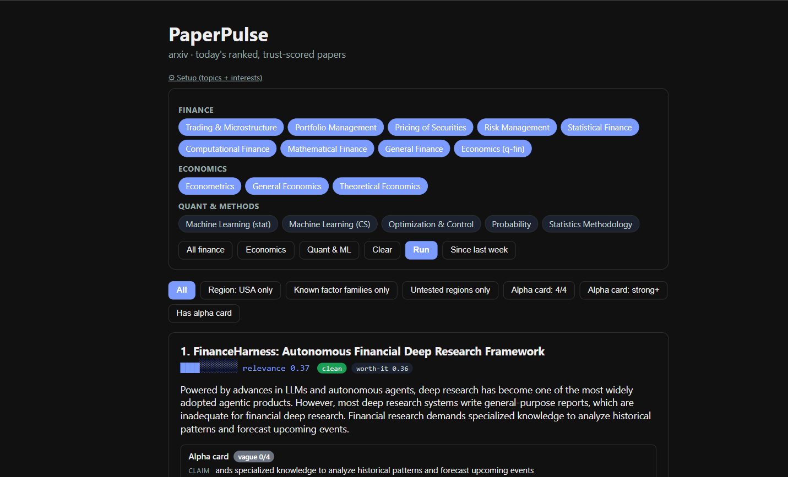

# PaperPulse

[](https://github.com/viki22uied/PaperPulse/actions/workflows/ci.yml)
[](https://pypi.org/project/paperpulse/)
[](https://www.python.org/)
[](LICENSE)
[](https://github.com/viki22uied/PaperPulse/stargazers)

**Every day, arXiv posts hundreds of new papers. PaperPulse picks the five that actually matter to you, tells you whether to trust them, and explains why — all in plain English.**

If this saves you from reading a paper that wasn't worth your time, a ⭐ helps other researchers find it too.

📄 **[See a real digest generated today →](examples/2026-07-31.md)** &nbsp;·&nbsp;
🗺️ **[Roadmap](ROADMAP.md)** &nbsp;·&nbsp;
🧪 **[Annotated example](examples/sample-digest.md)**



## What it actually does

1. **Ranks papers by what you care about.** You describe your interests in a sentence. PaperPulse ranks today's papers against that, and gets smarter every time you say "more like this" / "less like this."
2. **Flags papers that look shaky.** No error bars, no code, hyped-up language, results that only hold on one dataset — PaperPulse scans for the patterns that usually mean weaker work, and shows you exactly which words triggered the flag.
3. **Remembers what you've already ruled out.** Log a topic as "dead end, already tried" once, and PaperPulse will flag it every time it resurfaces — even in a different country's market or a different dataset.

No API keys, no paid services, no sign-up. It works offline out of the box.

```bash
pip install paperpulse
paperpulse init      # 30-second setup wizard
paperpulse run       # today's digest -> digests/YYYY-MM-DD.md
```

## Finance papers get an extra "alpha card"

If a paper claims to find a trading edge, PaperPulse pulls out the specifics: what it's predicting, what data it used, what numbers it reported, and over what time period. A card can be:

- **Strong** — data, numbers, and dates are all there. You could try to reproduce it.
- **Vague** — the paper talks about markets but gives you nothing to check. This is the important case: it looks credible until you notice there's nothing underneath.

```bash
paperpulse alpha                       # today's papers as alpha cards
paperpulse alpha --full-text           # also reads the actual PDF, not just the abstract (needs: pip install "paperpulse[pdf]")
```

## Using it

```bash
# Command line
paperpulse run --categories cs.LG cs.CL

# Scripting / automation -- structured JSON instead of markdown
paperpulse run --format json | jq '.papers[] | select(.trust.badge == "clean")'

# Straight into your reference manager
paperpulse export -o today.bib      # BibTeX -> Zotero, Mendeley, EndNote, LaTeX

# As a Python library
python -c "from paperpulse.pipeline import run_digest; from paperpulse.config import Config; \
           print(run_digest(Config(), dry_run=True).markdown)"

# Web dashboard (built in, no extra install)
paperpulse serve            # open http://127.0.0.1:8000
```

The dashboard has clickable topic filters, a settings panel to change what you're tracking without touching a config file, and renders any math in an abstract properly instead of showing raw symbols.

Or with Docker: `docker compose up`

## Why not just ask an LLM to summarize arXiv?

| | Typical "arXiv + LLM" script | PaperPulse |
|---|---|---|
| Ranking | Newest first | Ranked by *your* interests, and gets better as you give feedback |
| Trust | Trusts whatever the summary says | 15+ automated checks for weak/shaky work, each one explained |
| Memory | None — sees the same thing every day | Remembers what you've already ruled out |
| Cost | Needs an API key | Runs fully offline for free |

## More features

- **Multiple sources** — arXiv, bioRxiv, medRxiv, PubMed, SSRN
- **Finds contradictions** — flags pairs of recent papers that disagree with each other, and surfaces "What changed this week" in the digest itself
- **BibTeX export** — `paperpulse export` drops today's digest straight into Zotero, Mendeley, EndNote, or a LaTeX bibliography
- **JSON output** — `paperpulse run --format json` for scripts, dashboards, and cron jobs that want structured data, not markdown to parse
- **Compares to your own code** — `paperpulse similar my_model.py` finds papers closest to what you're already working on
- **Live prices for finance papers** — if a paper mentions the S&P 500, Bitcoin, etc., the dashboard shows the current price next to it (no API key needed)
- **Notes** — jot down your own thoughts against any paper and keep them
- **Delivery** — save to a file, email, RSS feed, or post to Slack/Discord
- **Shared trust database** — a team can pool their trust scores in one place, and measure whether the trust badge is actually predictive of what people like (`paperpulse score-accuracy`)
- **Prospective flag-validation ledger** — records every trust flag at assessment time, then reconciles against ground-truth outcomes (retraction via Crossref/OpenAlex, citation decline, out-of-sample decay via Chen-Zimmermann data). Per-badge calibration with Brier scores and lift over base rate (`paperpulse reconcile`, `paperpulse calibration`)
- **Finance paper overfitting screener** — flags t-stats below the Harvey-Liu factor-zoo hurdle (3.0), Sharpe ratios without disclosed trial counts (Deflated Sharpe Ratio gap), and missing out-of-sample validation
- **Polarity-flip monitor** — tracks contradiction pairs over time and alerts when a pair flips agreement-to-contradiction or vice versa, with per-pair consensus volatility metrics (`paperpulse polarity`)
- **Flag-survival benchmark** — community-pooled per-signal precision against realized outcomes: which flags actually predict problems? (`paperpulse flag-survival`)

## Configuration

`paperpulse init` writes a `paperpulse.yaml` you can edit by hand — see [`paperpulse.example.yaml`](paperpulse.example.yaml) for every option, commented.

API keys and passwords always go in environment variables, never in the config file: `OPENAI_API_KEY` / `ANTHROPIC_API_KEY` (only needed if you want AI-written summaries instead of the free built-in ones), `PAPERPULSE_SMTP_*` (email), `PAPERPULSE_SLACK_WEBHOOK` / `PAPERPULSE_DISCORD_WEBHOOK`, `NCBI_API_KEY`, `PAPERPULSE_API_TOKEN` (if set, every dashboard/API request — reads included — must carry it as a Bearer token).

### Security

- All outbound fetches that check a host allowlist (PDF downloads, code/data link checks) go through a shared no-redirect opener, so an allowlisted host can't be used to bounce a request off-host.
- SQLite access is fully parameterized; config is loaded with `yaml.safe_load`.
- `PAPERPULSE_API_TOKEN` gates every route except the static dashboard shell itself, which has nothing to protect.
- Found a real issue? Please open an issue rather than a public PR with exploit details.

## Scheduling

Run it daily with cron, or use the included GitHub Action to generate and commit a digest every weekday morning ([`.github/workflows/digest.yml`](.github/workflows/digest.yml)).

## Built with AI

Feature development, testing, and research for this project were done with the help of AI (Claude). The domain logic — what to build, which academic frameworks to operationalize (Harvey-Liu, DSR/PBO, Chen-Zimmermann), and how the signals should behave — comes from my own research background. AI accelerated the implementation, stress-testing, and iteration cycle.

## Contributing

```bash
pip install -e ".[dev]"
pytest
```

Tests run fully offline — no network, no API keys required. See [`ROADMAP.md`](ROADMAP.md) for what's built and what's planned.

## License

MIT — see [`LICENSE`](LICENSE).
